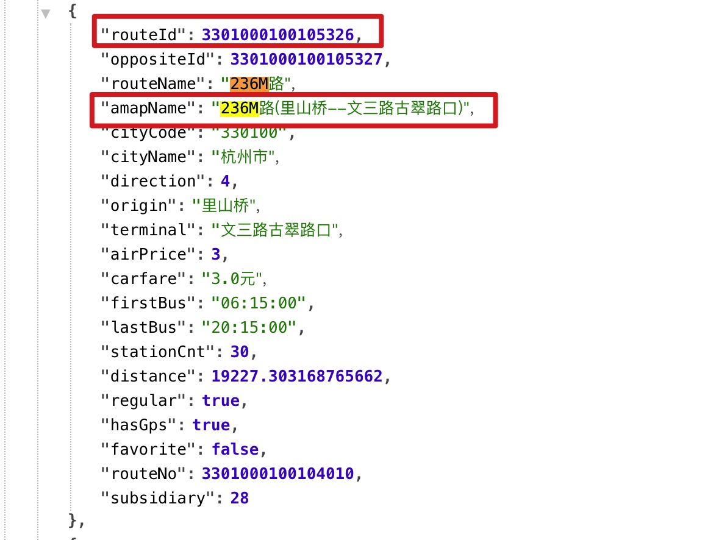
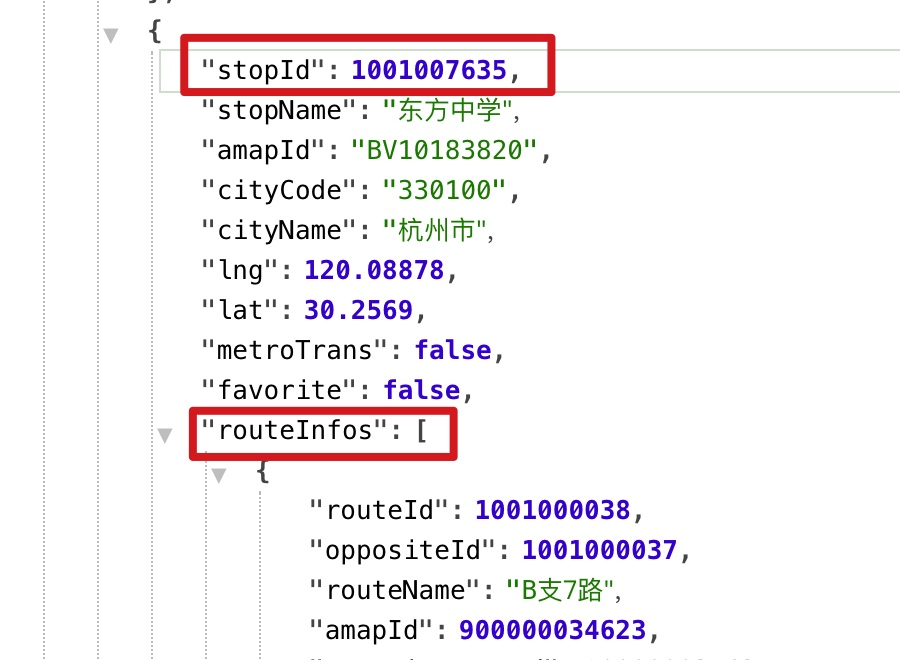
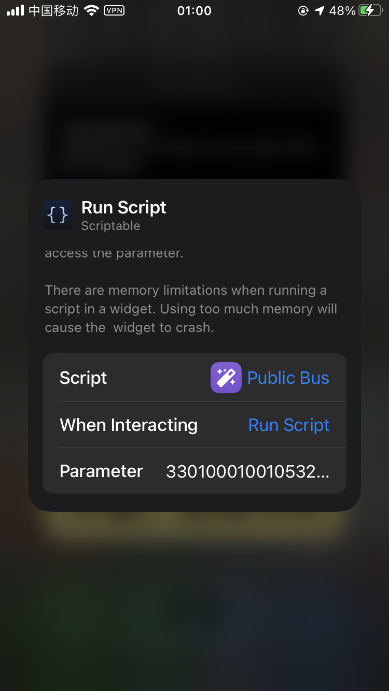

# Scriptable-杭州公交

声明，禁止使用本文内容用于恶意爬虫

## 举个🌰

想在挂件上查看，里山桥--文三路方向，`东方中学`站点的`236M`公交

### 获取routeId和stopId

先搜站点的公交信息，点击链接 <https://app.ibuscloud.com/v1/bus/findStopByName?city=330100&h5Platform=6&stopName=东方中学> ，如果想看其他站点则替换stopName后的站点名称

#### 获取routeId

会搜到两个routeName都236M路的routeInfo，根据amapName字段确定方向，保存 routeId: **3301000100105326**

#### 获取stopId

再往前翻，在routeInfos的上面，可以看到东方中学对应的stopId为**1001007635**

#### 设置挂件

根据前面的教程，得到routeId **3301000100105326**和stopId **1001007635**

拷贝文件本gist中的foolkit.js,ibuscloud.js,Public Bus.js三个文件到Scriptable中，添加Scriptable挂件，编辑挂件，选择脚本Public Bus，参数(Parameter)部分填入`3301000100105326,1001007635`即可，由于挂件的刷新机制是由os自动控制，如果想主动更新挂件，可以编辑挂件时，选择交互(When Interacting)为运行脚本(Run Script)，之后点击挂件即可主动触发刷新

